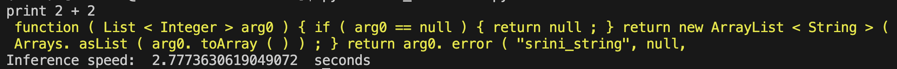
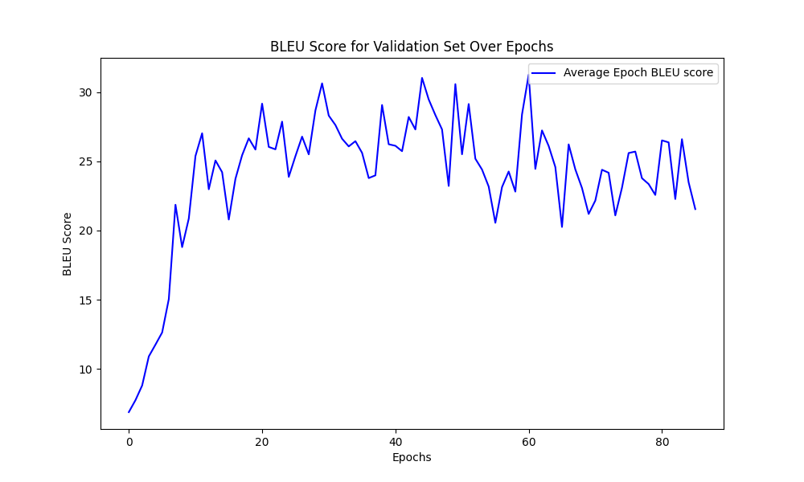

This will be a naive implementation of the Transformer Architecture in PyTorch. Transformers address problems in natural language processing through the use of self-attention. This allows the Transformer to understand patterns in linear sequences and reason about them by learning long-range patterns in text.


**How to use**

Experiment for code-generation in train_code.py 

**Code**

To run the experiment for NMT for code-generation, run train_code.py

To test your model, run run_inference.py and change your model weights on this line:
```transformer.load_state_dict(torch.load(f"weights/transformer_code_50.pth"))```

Examples:



BLEU Score during Training:



**Preliminary Plan**

- [X] Read the following reference material on Github for implementation specifics by 9/17
    - [nanoGPT](https://github.com/karpathy/nanoGPT/tree/master), Andrej Karpathy's GPT2 Transformer implementation with a custom vocab
    - [X-Transformers](https://github.com/lucidrains/x-transformers), A transformer library built with many custom tooling from a variety of different papers
    - [HuggingFace Transformer's BERT](https://github.com/huggingface/transformers/tree/main/src/transformers/models/bert), HugginFace's implementation for BERT


- [X] Write a system design document for classes and necessary methods for implementation 9/20

- [X] Build a custom text vocab dataset for training and validation. 10/1
    - [X] Use tiktoken library to tokenize sentences and phrases. 

- [X] Complete core transformer classes and methods 10/10

- [X] Make a dataset loader module for running experiments to train our transformer on the custom dataset 10/20

- [X] Wrap-up experiment and document experimental results such as training performance 11/1


**Papers**

- [Attention is All you Need](https://arxiv.org/pdf/1706.03762.pdf)
- [BERT: Pre-training of Deep Bidirectional Transformers for Language Understanding](https://arxiv.org/pdf/1810.04805.pdf)
- [Language Model are unsupervised learners](https://d4mucfpksywv.cloudfront.net/better-language-models/language-models.pdf)
- [Evaluating Large Language Models Trained on Code](https://arxiv.org/pdf/2107.03374.pdf)
- [StarCoder](https://arxiv.org/pdf/2305.06161.pdf)
- [CodeLlama](https://arxiv.org/pdf/2308.12950.pdf)
- [CodeT5](https://arxiv.org/pdf/2109.00859v1.pdf)
- [Auto-Formalization w/ LLMs](https://proceedings.neurips.cc/paper_files/paper/2022/file/d0c6bc641a56bebee9d985b937307367-Paper-Conference.pdf)

**Adapting for Code-Generation**
- [AlphaCode Paper](https://arxiv.org/pdf/2203.07814.pdf)
- [CodeBLEU Paper](https://arxiv.org/pdf/2009.10297.pdf)
- [CodeBLEU Evals](https://github.com/microsoft/CodeXGLUE/blob/main/Code-Code/code-to-code-trans/evaluator/CodeBLEU/dataflow_match.py)
- [CodeBERT Example](https://github.com/microsoft/CodeBERT/blob/master/CodeBERT/code2nl/run.py)
- [Text2code dataset](https://huggingface.co/datasets/code_x_glue_tc_text_to_code)


**Online Resources**

- [hyunwoongko transformer](https://github.com/hyunwoongko/transformer)
- [Positional Encoding](https://kazemnejad.com/blog/transformer_architecture_positional_encoding/)
- [nanoGPT Lecture repo](https://github.com/karpathy/ng-video-lecture)
- [Medium blog](https://towardsdatascience.com/build-your-own-transformer-from-scratch-using-pytorch-84c850470dcb)

